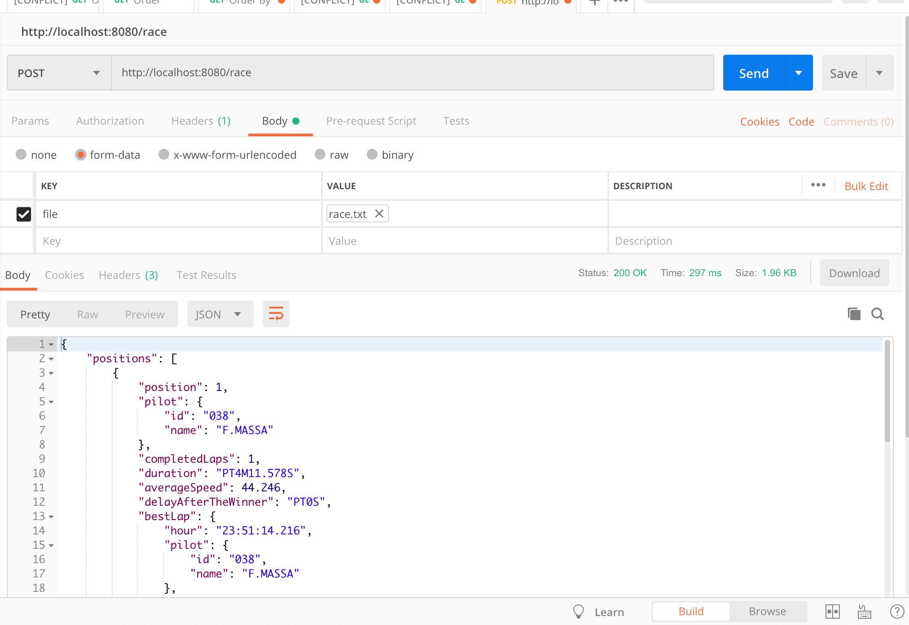

# race-challenge
Desafio Gympass

## Tecnologia, arquitetura e padrões

- Java 8;
- Gradle para *build* e *dependências* do projeto

**Frameworks, utilitários e plugins**

- Testes feitos com JUnit4, Mockito e Hamcrest matchers para tornar os *asserts* mais elegantes;
- Spring Boot 2.1.3
- Utilitário lombok

### Vamos lá

- Baixar o repositório para maquina:

```sh
git clone https://github.com/ThiagoMontezano/race-challenge.git
```
- Ir para o path do projeto:

```sh
...
$ cd race-challenge
$ ./gradlew clean build e caso for Windows utilize ./gradlew.bat clean build
```
- Para executar os testes:

```bash
...
./gradlew test
```

- Para executar o projeto:

```bash
...
./gradlew bootRun
```

**PS: Porta default configurada na aplicação *8080***


### Teste com POSTMAN (arquivo de teste em -> src/test/resources/file/race.txt )
<p>
  
</p>

Divirta-se!

